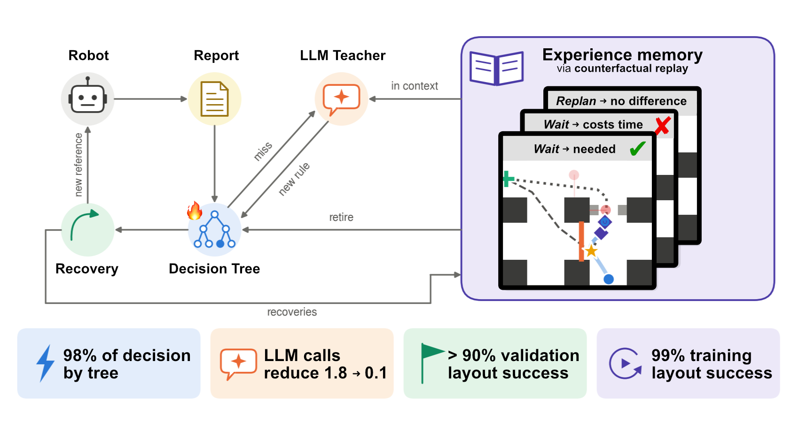
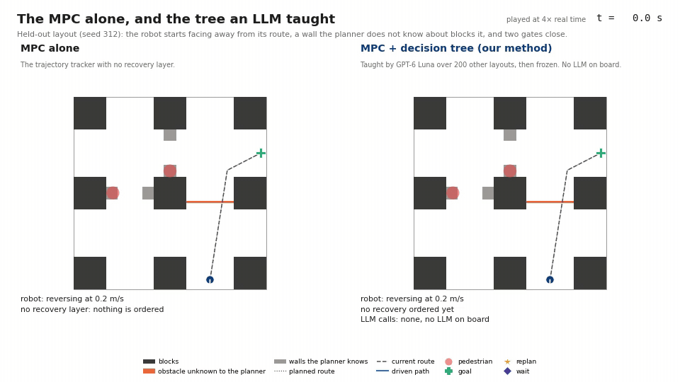

# Teaching a Tree to Recover: Online Distillation of an LLM Supervisor with Counterfactual Replay

Kristian Ceder, Kilian Freitag, Knut Åkesson (Chalmers University of Technology).
CoRL 2026 workshop. **[Paper](PAPER_LINK)** · **[Videos](#videos)**



An MPC-driven robot can freeze where its short horizon sees no way out, and deciding whether to replan,
wait or call a human is a job for a supervisor above the controller. We distill an LLM supervisor
online into a decision tree that asks the LLM only about situations it has not seen. After each
episode, counterfactual replay labels every recovery as needed, unnecessary or harmful, which retires
rules that only look right and is shown to the LLM in context. On 20 unseen layouts where the MPC alone
freezes, the frozen tree handles at least 18 correctly in every run with no LLM on board. That matches
both an LLM queried at every tick and hand-written rules.



*A held-out layout the tree never learned on, at 4x real time (8x once the tree has arrived). On its
own, the MPC stands at a wall the planner does not know about until the step budget runs out. With
the frozen decision tree on top and no LLM on board, the robot replans at the first tick, waits while
a pedestrian holds a gate, and reaches the goal in 65 s.*

This repository holds the controller, the simulated scenario grid, the supervisor, the scripts that run
every experiment in the paper, the recorded runs behind its tables and figures, and the scripts that
regenerate the tables, figures and videos from those recordings.

## Videos

Each scene replays recordings from `results/runs`. The side-by-side scenes show the same layout under
different deciders, played in sync. Every scene can be re-rendered with
`scripts/videos/render_scenes.sh` (see [Reproducing the paper](#reproducing-the-paper)).

| # | Scene | Video |
|---|---|---|
| 1 | **One held-out layout, four deciders** (seed 312; Sec. 4.2, Table 1). The robot starts facing away from its route, a wall the planner does not know about blocks it, and two gates close. The MPC alone runs out of time. The scripted rules and the frozen tree both reach the goal. The LLM asked at every tick orders a route resume out of a gate hold, which sends the robot 4.6 m back along the route, and it runs out of time. | [YouTube](YOUTUBE_LINK_1) |
| 2 | **A breakdown on an unseen layout** (seed 422; Sec. 4.3). An obstacle parks in the only passage and never leaves. The frozen trees of the method and of distillation alone both wait at first. Once the obstacle has stood for 30 s, the method's tree calls a human. Distillation alone keeps waiting until the watchdog stops the controller. | [YouTube](YOUTUBE_LINK_2) |
| 3 | **Where the scripted rules fail, 1 of 3** (learning layout 121; Sec. 4.3, App. B). A wall, then a gate. Both sides order the same two recoveries, but the tree replans before the robot has stopped, while the rules wait until it has stood still for 4 s. That 6 s head start is the whole margin. | [YouTube](YOUTUBE_LINK_3) |
| 4 | **Where the scripted rules fail, 2 of 3** (learning layout 246). The rules replan 8 s after the tree, and their robot reaches the gate as a pedestrian crosses it and collides. | [YouTube](YOUTUBE_LINK_4) |
| 5 | **Where the scripted rules fail, 3 of 3** (learning layout 280). The tree replans at once and turns to the new route. The rules replan 18 s later and stand behind a pedestrian in the gate until the time runs out. | [YouTube](YOUTUBE_LINK_5) |
| 6 | **Where the method fails** (learning layout 162; Sec. 4.3, App. B). This is the one learning layout that the method ends wrong in every run and the rules end right. The tree replans 12 s sooner and holds twice at the gate. It then holds 20 s more for a pedestrian on the route, and the step budget runs out. | [YouTube](YOUTUBE_LINK_6) |
| 7 | **A repeated layout** (layout 307, fifth visit; Sec. 4.4). The tree is learned from empty on this one layout, and on the fifth visit it waits and resumes behind pedestrians until the step budget runs out. | [YouTube](YOUTUBE_LINK_7) |

## Repository layout

```
config/mpc_default.yaml     MPC parameters (horizon, limits, weights, solver time cap)
src/
  mpc_traj_tracker/         the MPC trajectory tracker (CasADi + OpEn); README.md documents the formulation
  path_planning/            visibility-graph route planning on the inflated static map
  simulation/               the scenario grid (layouts with staged situations), obstacles, the episode world
  failure_monitor/          the supervisor
    report.py                 the status report and the evidence for each failure mode
    llm.py, openai_teacher.py the teacher's prompt and its call to the OpenAI API
    tree.py                   the decision tree, the outcome judge, rule retirement
    tree_analyzer.py          tree first, teacher on a miss
    experience.py             what the teacher is shown of what has been learned
    counterfactual.py         replays that label each recovery needed / unnecessary / harmful
    recovery.py               the recovery actions, executed against the live MPC
    scripted.py               hand-written rules: a baseline, the reference decisions are scored against,
                              and the fallback in replays
    episode.py                one closed-loop episode
  visualizer/               replay of recorded episodes
scripts/
  build_solver.py           compile the MPC solver
  run.py                    run episodes (learn a tree, evaluate one frozen, or run a baseline)
  run_experiments.sh        every run in the paper
  replay_run.py             counterfactual replays of a recorded run, after the fact
  self_test.py              logic checks on the tree, the judge and the rules (no solver, no model)
  visualize_run.py          watch a recorded run, or render it to video
  analysis/                 the paper's tables and figures, from results/runs
  videos/                   the supplementary video's scenes, from results/runs
results/
  runs/                     the recorded runs behind the paper (see results/README.md)
  tables/, figures/         what scripts/analysis writes, and the graphical abstract
```

## Installation

Requires Python 3.11 or newer, [uv](https://docs.astral.sh/uv/) and a Rust toolchain (`cargo`, for
compiling the MPC solver once).

```bash
git clone <this repository> && cd <it>
uv sync                                  # creates .venv with the locked dependencies
source .venv/bin/activate
python scripts/build_solver.py           # compiles the MPC solver into mpc_solver/ (a few minutes)
python scripts/self_test.py              # about a second; ends with PASS
```

(`uv venv --python 3.11 && uv pip install -e .` works too, without the lock. `uv sync --extra viz`
adds `imageio-ffmpeg` for MP4 export; without it videos are written as GIF.)

The solver is generated by opengen and CasADi, which are pinned to the versions the paper's runs used
(`opengen==0.11.0`, `casadi==3.8.1`): other versions generate a different solver, and a replay of the
shipped recordings then drifts within the first steps. The solver is platform-specific and not in the
repository; rebuild it after changing anything in `config/mpc_default.yaml` that shapes the
optimisation problem (horizon, obstacle counts, the solver time cap). Cost weights alone are read at
run time.

The GPT-6 Luna teacher is called through the OpenAI API and needs a key:

```bash
export OPENAI_API_KEY=sk-...             # e.g. in ~/.bashrc
```

Nothing else needs it: the scripted rules, frozen trees and everything under `scripts/analysis` run
without a key.

## Running

```bash
# The pipeline end to end with the scripted rules as teacher (no key, a few minutes)
python scripts/run.py --teacher scripted --episodes 5 --reset --memory both --simulate \
    --tree runs/demo.json --record runs/demo

# The method with GPT-6 Luna as teacher: learn on the 200 learning layouts
python scripts/run.py --teacher llm --episodes 200 --seed 100 --reset --memory both --simulate \
    --cf-retire-after 10 --checkpoint-every 25 --tree runs/method.json --record runs/method

# A learned tree frozen (no model, nothing learned or retired) on the 20 held-out layouts
python scripts/run.py --teacher none --episodes 20 --seed 300 --no-learn --no-save \
    --tree runs/method.ep0200.json --record runs/method_heldout

python scripts/run.py --show --tree runs/method.json      # print a tree and how it was learned
python scripts/visualize_run.py runs/method_heldout      # watch the recorded episodes
```

`scripts/run.py --help` lists every option. Episode `k` of a run uses layout seed `seed + k`: seeds
100-299 are the learning stream, 300-319 the held-out layouts and 400-499 the unseen ones. Each run
writes the tree (`--tree`), checkpoints of it (`<tree>.epNNNN.json`), the experience table
(`<tree>.experience.json`), a log of every teacher call with the report it was shown (`<tree>.jsonl`),
the API usage per call with latency, tokens and cost (`<tree>.api.jsonl`), and, with `--record`, one
JSON file per episode.

## Reproducing the paper

The recorded runs are in `results/runs`, so the tables and figures can be regenerated without
running anything:

```bash
python scripts/analysis/paper_tables.py        # results/tables/paper_tables.md: every number in the results
python scripts/analysis/learning_failures.py   # results/tables/learning_failures.md: the appendix's failure table
python scripts/analysis/fig_loop.py            # Fig. 2, the loop schematic
python scripts/analysis/fig_heldout_curve.py   # Fig. 3
python scripts/analysis/fig_permap.py          # Fig. 4 and results/tables/permap.md
python scripts/analysis/fig_scenario_grid.py   # the scenario-grid figure in the appendix
```

The graphical abstract (Fig. 1, `results/figures/graphical_abstract.png`) was drawn by hand and has
no script.

The videos are rendered from the same recordings (about ten minutes; needs `uv sync --extra viz` and
no solver) into `videos/`:

```bash
scripts/videos/render_scenes.sh                 # the seven scenes, one file each
python scripts/videos/merge_videos.py           # videos/supplementary.mp4: all seven with title cards
python scripts/videos/compare_video.py luna312 --still 280   # one frame of one scene as PNG
python scripts/videos/compare_video.py readme312 --speed 4 --fast 8 --dpi 60 --gif 960   # the GIF above
```

The GIF is `videos/readme312.gif`, copied to `results/figures/method_demo.gif`.

To re-run the experiments themselves (into a new directory, so the shipped runs stay as they are):

```bash
OUT=runs/paper scripts/run_experiments.sh baselines   # no recovery, scripted rules, GPT-6 Luna alone
OUT=runs/paper scripts/run_experiments.sh arms        # the method and its two ablations, 3 runs each
OUT=runs/paper scripts/run_experiments.sh permap      # per-map self-improvement
python scripts/replay_run.py runs/paper/scripted_learning   # the scripted rules' replay labels (2.5 h)
```

and regenerate the tables and figures from those with `RUNS=runs/paper python scripts/analysis/...`.
The whole set takes about a day on a laptop CPU and costs well under one US dollar in API calls; the script skips runs that are already complete,
so it can be interrupted and restarted.

Expect the same picture rather than identical numbers. The MPC solve is capped by wall-clock time
(`max_solver_time_micros`), so a solve near the cap returns a different control depending on machine
load, and where the controller watchdog trips depends on the machine; the teacher is a hosted model
answering at temperature 0, which is not bit-reproducible either. The layouts themselves are a
deterministic function of the seed. The shipped runs were all made on one laptop.
